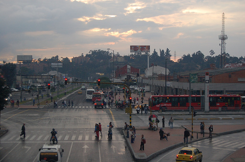
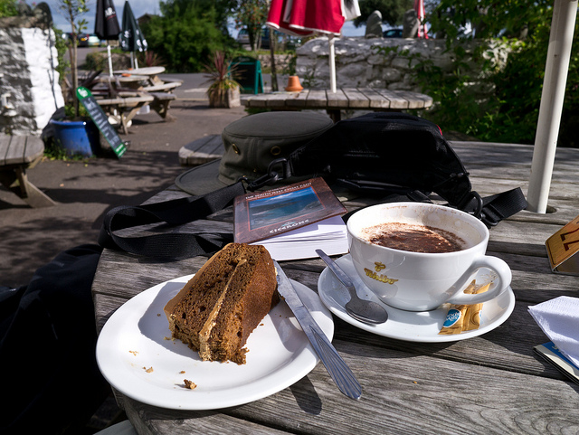
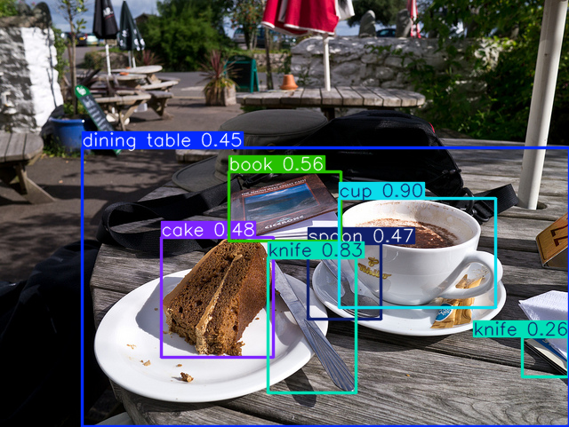

<h1>Rede detecção Yolo</h1>

<h2>Desafio 4</h2>

<h3>Objetivo:</h3>
<p>Este projeto foi desenvolvido como parte do Bootcamp BairesDev - Machine Learning Practitioner, oferecido pela Digital Innovation One (DIO). 
  O objetivo deste desafio é gerar imagens de detecção a partir de uma rede já treinada.</p>

-------------------------------------------------------

-------------------------------------------------------

-------------------------------------------------------

-------------------------------------------------------


-------------------------------------------------------

-------------------------------------------------------

-------------------------------------------------------

-------------------------------------------------------
## Tecnologias Usadas

- **Rede Yolo
- **Python 3 v3.12
-----------------------------------------------------------
## Instalação e Setup:

Clone the project

```bash
  git clone https://github.com/daniel-neves-dev/rede_yolo.git
```

Go to the project directory

```bash
  cd rede_yolo
```

Install ultralytics

```bash
  pip install ultralytics
```

On the terminal type

```bash
  python3 main.py